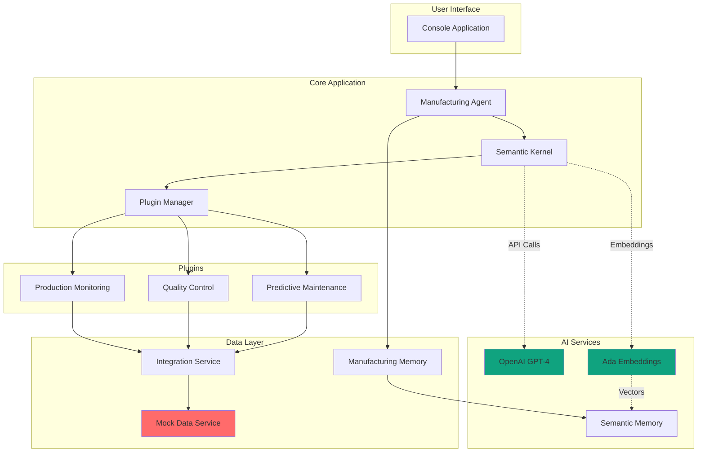
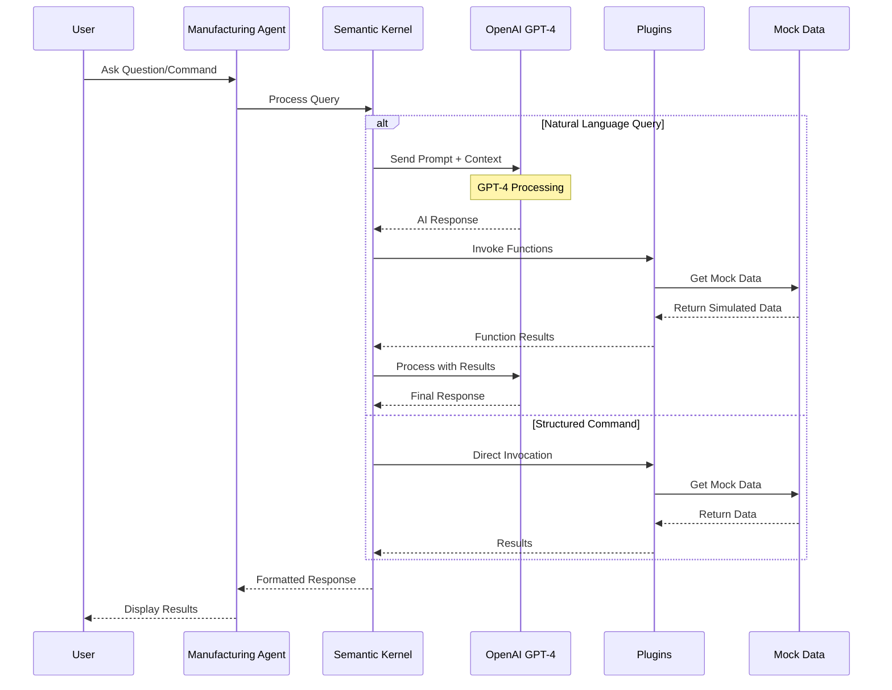
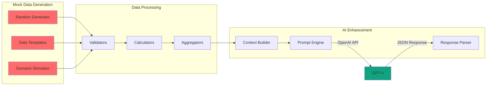
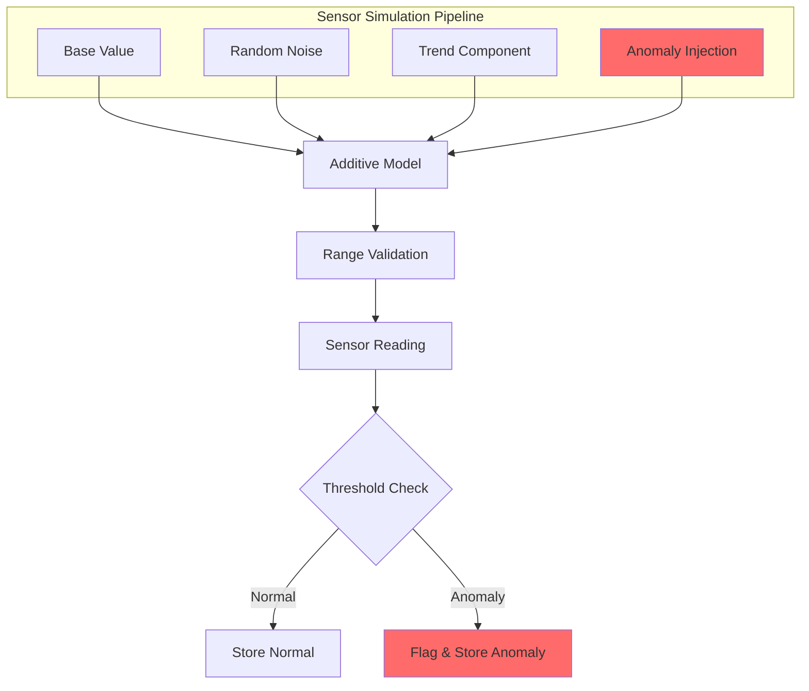
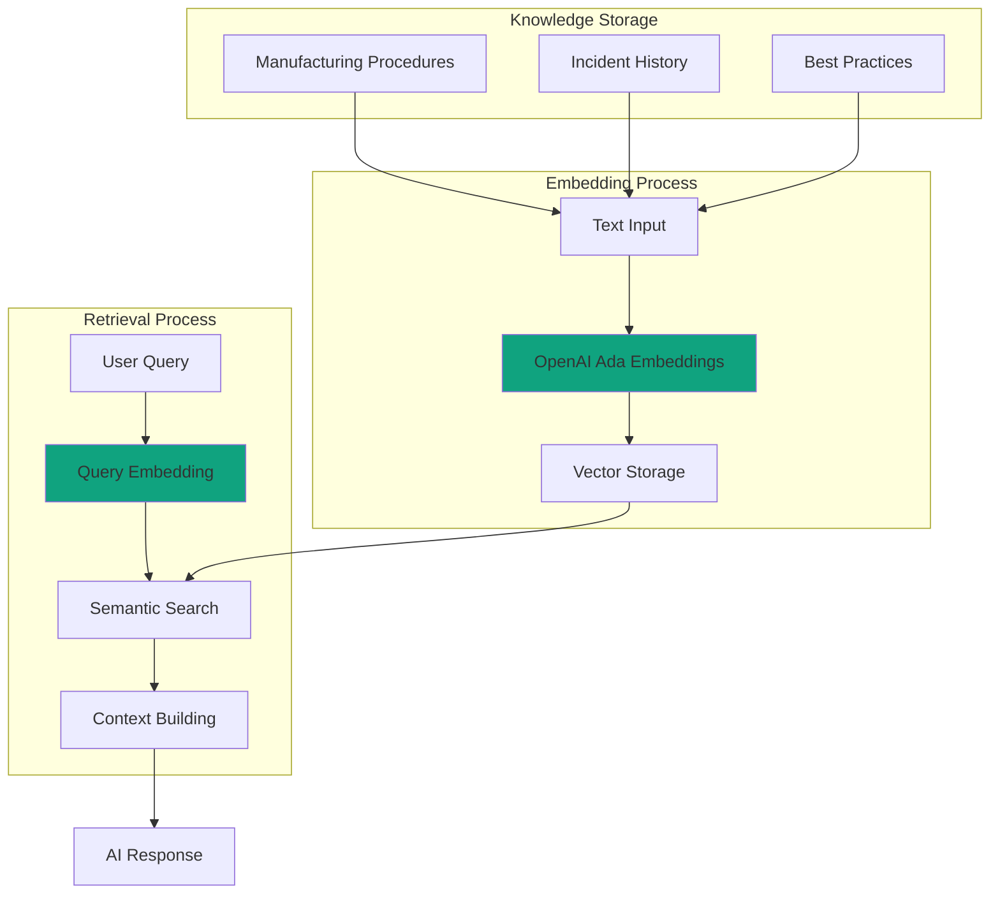

# Manufactron - AI-Powered Manufacturing Intelligence System

An advanced agentic framework for manufacturing built with .NET and Microsoft Semantic Kernel, powered by OpenAI GPT-4. This system provides autonomous monitoring, analysis, and optimization of manufacturing processes with sophisticated mock data generation for testing and demonstration.

## Features

### Core Capabilities
- **Production Monitoring**: Real-time tracking of production lines, OEE calculation, and performance metrics
- **Quality Control**: Automated quality analysis, defect detection, and improvement recommendations
- **Predictive Maintenance**: ML-based failure prediction, MTBF calculation, and maintenance scheduling
- **Anomaly Detection**: Real-time sensor data analysis and anomaly identification
- **Intelligent Planning**: AI-powered production planning and optimization
- **Memory System**: Knowledge base with incident history and best practices
- **System Integration**: Connectors for ERP, MES, SCADA, and IoT platforms

### Agent Architecture
- **Manufacturing Agent**: Core agent for processing queries and scenarios
- **Domain Plugins**: Specialized plugins for production, quality, and maintenance
- **Orchestrator**: Multi-agent coordination for complex events
- **Memory Store**: Semantic memory for knowledge retention and retrieval

## Prerequisites

- .NET 9.0 SDK or later
- OpenAI API key
- Visual Studio 2022 or VS Code (optional)

## Installation

1. Clone the repository:
```bash
git clone https://github.com/yourusername/manufactron.git
cd manufactron
```

2. Configure your OpenAI API key in `appsettings.json`:
```json
{
  "OpenAI": {
    "ApiKey": "your-openai-api-key-here",
    "ModelId": "gpt-4-turbo-preview",
    "EmbeddingModelId": "text-embedding-ada-002"
  }
}
```

Or set the environment variable:
```bash
set OPENAI_API_KEY=your-openai-api-key
```

3. Restore packages:
```bash
dotnet restore
```

## 📊 Quick Start Guide

Run the application:
```bash
dotnet run
```

The system will start with an interactive menu:

```
═══ Manufacturing Agent Menu ═══
1. Check Production Status
2. Analyze Quality Metrics
3. Predict Maintenance Needs
4. Detect Anomalies
5. Generate Optimization Recommendations
6. Ask Manufacturing Question
7. Simulate Manufacturing Event
8. Exit
```

## 📖 User Guide and Walkthrough

### 1️⃣ Check Production Status
Monitor real-time production line status with OEE calculations.

**Example Session:**
```
Select option: 1
Enter Line ID (e.g., LINE-001): LINE-001

📊 Production Status for LINE-001:
  • Line: LINE-001
  • Status: Running
  • Throughput: 850 units/hour
  • Efficiency: 92%
  • Last Updated: 14:23:45
  • Metrics:
    - Temperature: 72.5°C
    - Pressure: 145 PSI
    - Speed: 1200 RPM
    - UpTime: 0.92

📈 OEE Metrics (8 hours):
  • Overall OEE: 82.3%
```

### 2️⃣ Analyze Quality Metrics
Perform comprehensive quality analysis on production batches.

**Example Session:**
```
Select option: 2
Enter Batch ID (e.g., BATCH-001): BATCH-001

🔍 Quality Analysis for BATCH-001:
  • Batch: BATCH-001
  • Quality Score: 95%
  • Status: ✅ PASSED
  • Inspection Date: 2024-01-15 10:30
  • Quality Metrics:
    - Dimension Accuracy: 0.98 (Target: 0.95, ✓)
    - Surface Finish: 0.92 (Target: 0.90, ✓)
    - Weight Variance: 0.03 (Target: 0.05, ✓)
```

### 3️⃣ Predict Maintenance Needs
Leverage AI to predict equipment failures and maintenance requirements.

**Example Session:**
```
Select option: 3
Enter Equipment ID (e.g., EQUIP-001): EQUIP-001

🔧 Maintenance Prediction for EQUIP-001:
  • Equipment: EQUIP-001
  • Equipment Name: CNC Machine Alpha
  • Failure Probability: 75%
  • Predicted Failure: 2024-01-25
  • Recommended Action: Schedule preventive maintenance
  • Estimated Downtime: 4.5 hours
  • Estimated Cost: $2,500
  • Risk Factors:
    - Bearing wear detected
    - Vibration levels increasing

📊 MTBF Metrics (365 days):
  • Mean Time Between Failures: 720.5 hours
```

### 4️⃣ Detect Anomalies
Real-time anomaly detection in sensor data.

**Example Session:**
```
Select option: 4

🎯 Analyzing sensor data: Temperature = 88.5 °C

📊 Anomaly Detection Result:
  • Status: ⚠️ ANOMALY DETECTED
  • Type: Temperature Excursion
  • Confidence: 92%
  • Description: Detected Temperature Excursion in sensor SENSOR-001
  • Affected Metrics: Temperature
```

### 5️⃣ Generate Optimization Recommendations
AI-powered production optimization using OpenAI GPT-4.

**Example Session:**
```
Select option: 5

🤖 Generating optimization recommendations...

Based on analysis of production scenario:

1. **Optimize Changeover Process**
   - Current: 45 minutes average
   - Target: 20 minutes using SMED
   - Impact: 5% efficiency gain

2. **Adjust Temperature Settings**
   - Issue: High variance causing defects
   - Solution: Tighten control to 75°C ± 2°C
   - Impact: 15% defect reduction

3. **Preventive Maintenance Schedule**
   - Risk: Equipment EQUIP-003 wear patterns
   - Action: Schedule during next downtime
   - Benefit: Prevent 8 hours unplanned downtime
```

### 6️⃣ Ask Manufacturing Question
Natural language interface powered by OpenAI for manufacturing expertise.

**Example Session:**
```
Select option: 6
Enter your question: What are best practices for reducing defects in injection molding?

🤖 Manufacturing Agent Response:

Best practices for reducing injection molding defects:

1. **Material Preparation**
   - Proper drying of hygroscopic materials
   - Consistent material temperature
   - Optimal regrind ratios

2. **Process Optimization**
   - Optimize injection speed/pressure profiles
   - Maintain proper mold temperature
   - Ensure adequate cooling time

3. **Mold Maintenance**
   - Regular cleaning and inspection
   - Proper venting to prevent gas traps
   - Maintain runner and gate dimensions
```

## 🏭 Technical Architecture

### System Overview with OpenAI Integration



### OpenAI Integration Flow



### Mock Data Generation Pipeline



## Architecture

```
Manufactron/
├── Agents/              # Core agent implementations
├── Plugins/             # Semantic Kernel plugins
│   ├── ProductionMonitoringPlugin.cs
│   ├── QualityControlPlugin.cs
│   └── MaintenancePlugin.cs
├── Models/              # Data models and DTOs
├── Memory/              # Memory and context management
├── Planning/            # Planning and orchestration
├── Integration/         # External system integrations
├── Configuration/       # Configuration files
└── Program.cs           # Main entry point
```

## 🔄 Mock Data System

### Mock Data Generation Strategy

The system uses sophisticated mock data generation to simulate realistic manufacturing scenarios:

```csharp
// Production Status Mock Data
public ProductionStatus GenerateMockStatus(string lineId)
{
    return new ProductionStatus
    {
        LineId = lineId,
        Status = RandomChoice("Running", "Idle", "Maintenance"),
        Throughput = 800 + Random(-100, 100),
        Efficiency = 0.85 + Random(0.0, 0.1),
        Metrics = new Dictionary<string, object>
        {
            ["Temperature"] = 72.5 + Random(-5, 5),
            ["Pressure"] = 145 + Random(-10, 10),
            ["Speed"] = 1200 + Random(-100, 100),
            ["UpTime"] = 0.92 + Random(0.0, 0.05)
        }
    };
}
```

### Sensor Data Simulation



### Mock Scenario Examples

```csharp
// Equipment Failure Simulation
var failure = new EquipmentFailure
{
    EquipmentId = "PUMP-001",
    FailureType = "Bearing Failure",
    Severity = "Critical",
    PredictedDowntime = 4.5,
    Impact = new[] { "LINE-001", "LINE-002" }
};

// Quality Deviation Simulation
var qualityIssue = new QualityDeviation
{
    BatchId = "BATCH-789",
    DefectRate = 0.08,  // 8% defect rate
    RootCause = "Temperature variance",
    AffectedUnits = 150
};

// Anomaly Injection
var anomaly = new SensorAnomaly
{
    SensorId = "TEMP-003",
    Type = "Temperature Spike",
    Value = 95.5,  // Above threshold of 85
    Duration = TimeSpan.FromMinutes(5)
};
```

## 🤖 OpenAI Integration Details

### Prompt Engineering Examples

```csharp
// Optimization Recommendations Prompt
[KernelFunction]
public async Task<string> GenerateOptimizations(
    ManufacturingScenario scenario)
{
    var prompt = @"
    You are a manufacturing optimization expert.
    Analyze the following production data:
    - Line: {{$scenario.LineId}}
    - Efficiency: {{$scenario.Efficiency}}%
    - OEE: {{$scenario.OEE}}%
    - Recent Issues: {{$scenario.Issues}}

    Provide 3 specific, actionable recommendations to improve
    production efficiency. Include estimated impact and
    implementation complexity for each.
    ";

    return await kernel.InvokePromptAsync(prompt,
        new() { ["scenario"] = scenario });
}
```

### Function Calling with OpenAI

```csharp
[KernelFunction, Description("Analyze manufacturing scenario")]
public async Task<AnalysisResult> AnalyzeScenario(
    [Description("Manufacturing scenario")] ManufacturingScenario scenario)
{
    // OpenAI function calling automatically handles parameter marshalling
    var result = await kernel.InvokePromptAsync<AnalysisResult>(
        @"Analyze this manufacturing scenario and identify:
        1. Key performance issues
        2. Root causes
        3. Improvement opportunities
        4. Risk factors

        Scenario: {{$json}}",
        new() { ["json"] = JsonSerializer.Serialize(scenario) }
    );

    return result;
}
```

### Semantic Memory Integration



## Key Components

### Plugins

#### Production Monitoring Plugin
- `GetProductionStatus`: Real-time production line monitoring
- `DetectAnomalies`: Sensor data anomaly detection
- `CalculateOEE`: Overall Equipment Effectiveness calculation
- `GetSensorReadings`: Real-time sensor data retrieval

#### Quality Control Plugin
- `AnalyzeQuality`: Batch quality analysis
- `PredictQualityIssues`: Quality prediction based on parameters
- `GenerateQualityRecommendations`: Quality improvement suggestions
- `CalculateFirstPassYield`: FPY calculation

#### Maintenance Plugin
- `PredictMaintenance`: Predictive maintenance using ML
- `ScheduleMaintenance`: Maintenance task scheduling
- `CalculateMTBF`: Mean Time Between Failures
- `GetMaintenanceHistory`: Historical maintenance records
- `OptimizeMaintenanceCosts`: Cost optimization recommendations

### Integration Points

The system is designed to integrate with:
- **ERP Systems**: Inventory and production order management
- **MES (Manufacturing Execution Systems)**: Real-time production data
- **SCADA Systems**: Sensor data and control
- **IoT Platforms**: Device telemetry and commands

Currently, the system operates with simulated data but can be easily connected to real systems by updating the `SystemIntegrationService`.

## Configuration

Edit `appsettings.json` to configure:

```json
{
  "Manufacturing": {
    "MonitoringInterval": "00:05:00",
    "AlertThresholds": {
      "Temperature": 85.0,
      "Pressure": 150.0,
      "QualityScore": 0.95
    },
    "SystemIntegration": {
      "ERPEndpoint": "https://your-erp-system.com/api",
      "MESEndpoint": "https://your-mes-system.com/api",
      "SCADAEndpoint": "https://your-scada-system.com/api"
    }
  }
}
```

## Extending the System

### Adding New Plugins

Create a new plugin class with Semantic Kernel functions:

```csharp
public class CustomPlugin
{
    [KernelFunction, Description("Your function description")]
    public async Task<Result> YourFunction(
        [Description("Parameter description")] string parameter)
    {
        // Implementation
    }
}
```

Register in `Program.cs`:
```csharp
kernel.ImportPluginFromType<CustomPlugin>("CustomPlugin");
```

### Adding New Agents

Implement the `IManufacturingAgent` interface:

```csharp
public class CustomAgent : IManufacturingAgent
{
    public string AgentType => "Custom";

    public async Task<object> ProcessEvent(ManufacturingEvent evt)
    {
        // Process manufacturing event
    }
}
```

## 📡 OpenAI API Configuration

### Token Usage and Costs

```json
{
  "OpenAI": {
    "ApiKey": "sk-...",
    "ModelId": "gpt-4",
    "EmbeddingModelId": "text-embedding-ada-002",
    "MaxTokens": 2000,
    "Temperature": 0.7,
    "TopP": 0.95
  }
}
```

### Performance Metrics

- **Response Time**: 1-3 seconds for OpenAI calls
- **Token Usage**: Average 500-1500 tokens per request
- **Embedding Dimensions**: 1536 (Ada-002)
- **Context Window**: 8,192 tokens (GPT-4)
- **Concurrent Requests**: Up to 10 parallel calls

## 🧪 Testing with Mock Data

### Mock Data Modes

1. **Deterministic Mode**: Seeded random for reproducible tests
```csharp
var mockService = new MockDataService(seed: 12345);
```

2. **Anomaly Mode**: Inject failures and issues
```csharp
mockService.EnableAnomalyMode(rate: 0.1); // 10% anomaly rate
```

3. **Stress Mode**: High-volume data generation
```csharp
mockService.EnableStressMode(eventsPerSecond: 1000);
```

## Development

### Building
```bash
dotnet build
```

### Running Tests
```bash
dotnet test
```

### Publishing
```bash
dotnet publish -c Release
```

## Deployment Considerations

For production deployment:

1. **Containerization**: Deploy as Docker containers in Kubernetes
2. **Message Queuing**: Use Azure Service Bus or RabbitMQ for agent communication
3. **Observability**: Implement comprehensive logging and monitoring
4. **Security**: Ensure proper authentication and authorization
5. **Scalability**: Design for horizontal scaling of agent instances
6. **Reliability**: Implement circuit breakers and retry policies

## Security Notes

- Never commit API keys to source control
- Use Azure Key Vault or similar for production secrets
- Implement proper authentication for system integrations
- Ensure data encryption in transit and at rest

## Contributing

1. Fork the repository
2. Create a feature branch
3. Make your changes
4. Submit a pull request

## License

MIT License - See LICENSE file for details

## Support

For issues and questions, please open an issue on GitHub.

## Acknowledgments

- Built with [Microsoft Semantic Kernel](https://github.com/microsoft/semantic-kernel)
- Powered by [OpenAI](https://openai.com/)
- Inspired by Industry 4.0 and smart manufacturing principles